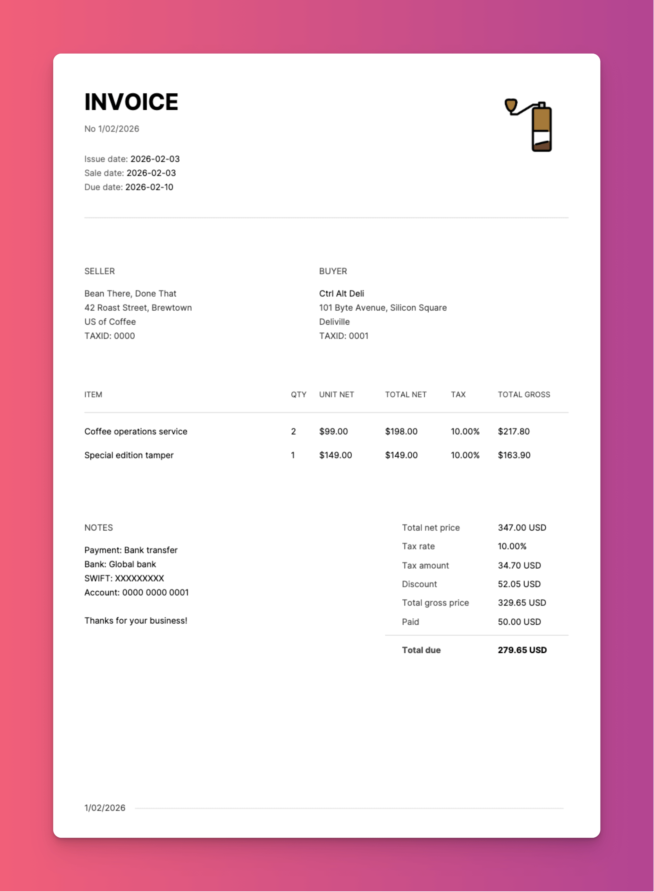

# Invoice

Generate invoices from the command line. 💵 

✅ Multilingual invoices
✅ Updated invoice design that fits more info
✅ More granular tax handling
✅ Payment info on invoice

> **Note:** This is a fork of [maaslalani/invoice](https://github.com/maaslalani/invoice/) with additional features and modifications. I wanted to solve some of the issues of the original project that seems abandoned and also add more functionality that I needed personally.

## Example invoice

Shows all available details:



## Use via command line interface

```bash
invoice generate --from "Dream, Inc." --to "Imagine, Inc." \
    --item "Coffee operations service" --quantity 2 --rate 25 \
    --tax 0.13 --discount 0.15 \
    --paymentMethod "Bank transfer" --bank "Global bank" --swift "XXXXXXXX" --accountNo "0000 0000 0001" \
    --note "Thanks for your business\!"
```

The generated PDF is saved in the `output/` directory. The filename is based on the invoice ID plus the language code (e.g. `20260202-001-en.pdf`), normalized to a safe lowercase filename.

## Use via configuration file

Save repeated information with JSON / YAML:

```json
{
  "lang": "en",
  "id": "20260202-001",
  "title": "INVOICE (optional) *",

  "logo": "/path/to/image.png",
  "logoScale": 80,

  "from": "Bean There, Done That \n42 Roast Street, Brewtown \nUS of Coffee \nTAXID: 0000",
  "to": "Ctrl Alt Deli \n101 Byte Avenue, Silicon Square \nDeliville \nTAXID: 0001",

  "date": "2026-02-02",
  "saleDate": "2026-02-02",
  "due": "2026-02-16 (optional) **",
  "billingPeriod": "January 2026 (optional) ***",

  "items": [
    "Coffee operations service",
    "Special edition tamper"
  ],
  "quantities": [
    2, 
    1
  ],
  "rates": [
    99, 
    149
  ],
  "paid": 50.0,

  "tax": 0.13,
  "taxName": "VAT (optional)",
  "discount": 0.05,
  "currency": "EUR",

  "paymentMethod": "Bank transfer",
  "bank": "Global bank",
  "swift": "XXXXXXXXX",
  "accountNo": "0000 0000 0001",

  "note": "Thanks for your business!"
}
```

- Note * If you add title to your json, it will take precedence over the default invoice title and its translations.
- Note ** If not provided, it will be set to 7 days by default.
- Note *** Billing period is optional (e.g. `"January 2026"` or `"Q1 2026"`). When set, it is shown on the invoice below the due date.

## Localization

To change the language of fixed labels on the invoice (title, column headers, notes labels, totals labels, etc.):

- Language files live in the `lang/` directory, for example `lang/en.json`, `lang/pl.json`.
- Each file defines all translatable strings used in the PDF.
- Select a language by setting `lang`:

```bash
invoice generate \
  --lang en \
  --item "Coffee operations service" --quantity 5 --rate 25
```

Or in the JSON/YAML config:

```json
{
  "lang": "en",
  "items": ["Coffee operations service"],
  "quantities": [1],
  "rates": [25]
}
```

The app requires a complete `lang/en.json` file to run. Every language file (`lang/<code>.json`) must define all required keys; if any are missing, invoice generation fails with an error listing the missing keys.

Generate new invoice by importing the configuration file:

```bash
invoice generate --import path/to/data.json
```

## Changelog (fork highlights)

- **Logo scaling**: Added a `logoScale` parameter to JSON and CLI so you can precisely control the logo size in the top‑right corner without editing the image itself.
- **Richer JSON config**: Extended the example input to support more fields (dates, currency, tax name, paid amount, bank details, etc.) so a single JSON file can fully describe an invoice.
- **Invoice layout redesign**: Realigned the PDF layout (logo, title, invoice number, dates, seller/buyer columns, dividers) for better readability and to fit more information consistently.
- **Custom tax label (`taxName`)**: Added support for a custom tax label (e.g. `VAT`, `GST`), used in both per‑item and totals sections instead of a hard‑coded “Tax”.
- **Totals currency labels**: Updated the totals section to display amounts as `123.45 USD` (currency code after the number) instead of using symbols like `$123.45`.
- **ISO date format**: Standardized invoice dates (issue, sale, due) to ISO format `YYYY-MM-DD` to avoid locale ambiguity.
- **Paid amount & total due**: Added a `paid` field and now show both “Paid” and “Total due” in the totals section (total gross minus paid).
- **Billing period**: Optional `billingPeriod` parameter (JSON/YAML/CLI). When set, it is displayed on the invoice below the due date; the label comes from the language file. Omit to hide.
- **Multilingual support**: Introduced JSON‑based language files in `lang/` (e.g. `en.json`, `pl.json`) for all fixed labels, with validation to ensure language files are complete.
- **Skip zero‑quantity items**: Items whose quantity is explicitly set to `0` are no longer rendered on the invoice.
- **Config/dep cleanup**: Removed non‑functional environment‑variable wiring and the related README section, and cleaned up unused Go dependencies to match the current code.

## Installation

### Local Installation

To build and install from the local source code:

```sh
# Clone the repository (if not already cloned)
git clone https://github.com/carlosinho/invoice.git
cd invoice

# Build the binary; you need to have go on your system
go build -o invoice .
```

After building, you can run the invoice command directly:

```sh
./invoice generate --from "Dream, Inc." --to "Imagine, Inc." --item "Service" --quantity 1 --rate 100
```

Or my fav, via json import:

```sh
./invoice generate --import _your_input.json
```

### Remote Installation

Install directly from GitHub:

```sh
go install github.com/carlosinho/invoice@main
```

Or download a binary from the [releases](https://github.com/carlosinho/invoice/releases).

## License

[MIT](https://github.com/maaslalani/invoice/blob/master/LICENSE)
